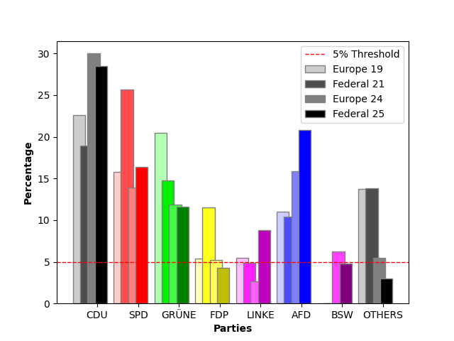
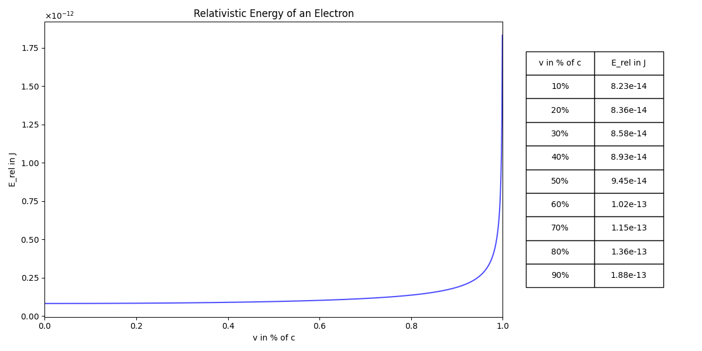
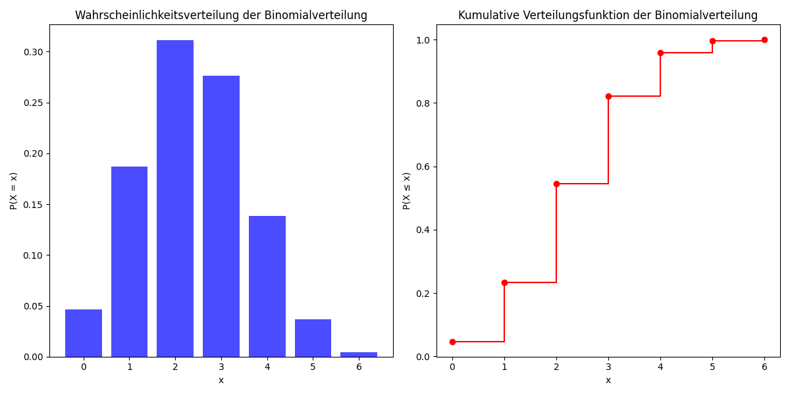

# Matplotlib-Physics

## About
What started out as a simple private synchronization workspace, exclusively created for modelling, sharing and discussing
a physics related movie scene (hence the name), has since expanded and become just a collection of various Matplotlib scenes
and other visualizations.

If it weren't for all the existing references to resources on here, I'd change the name to something more fitting.

Because this was created for the sake of sharing specific plots with schoolmates, most of the scripts are already rendered 
and saved in the`assets` folder

### Examples

